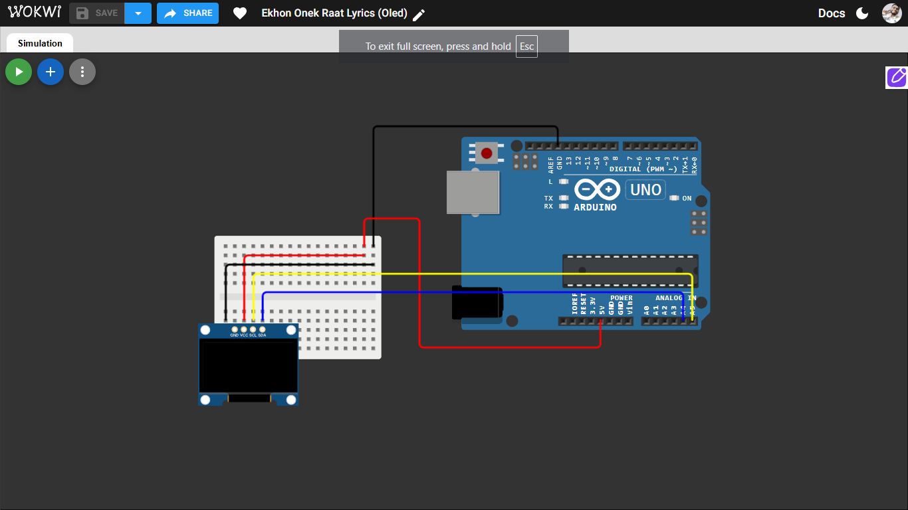

# OLED Lyric Sync

A small Arduino project that displays song lyrics on a 128x64 I2C OLED screen, timed to sync with a song playing separately on a laptop/phone — like a mini offline karaoke display.

## What it does

- Shows a "Ready" screen on power-up
- Runs a 3-2-1 countdown so you can hit play on the song at the right moment
- Displays each lyric line at the correct time using an internal timer (no delay-blocking)
- Supports per-line text size (for longer lines that don't fit at the default size)
- Shows a blinking animated outro ("See you in Day 7" + "SUBSCRIBE") after the last line

## Components used

- Arduino Uno
- 0.96" OLED display, SSD1306 driver, 128x64, I2C

## Wiring

| OLED Pin | Arduino Uno |
|---|---|
| GND | GND |
| VDD | 5V |
| SCL | A5 |
| SDA | A4 |

## Libraries required

Install via Arduino IDE Library Manager:
- **Adafruit SSD1306**
- **Adafruit GFX Library** (installs automatically as a dependency)

## Circuit

**Try it in simulation:** [https://wokwi.com/projects/475042954321261569]

## How to use

1. Upload `ekhononekraat.ino` to the Arduino.
2. Cue the song on a separate device to the exact timestamp the lyric array starts from.
3. Power on / reset the Arduino — it shows "Ready," then counts down 3...2...1.
4. Press play on the song the instant "1" disappears.
5. Lyrics display in sync as the song plays.
6. After the last line, the outro animation loops until the board is reset.

## Known limitations

- Sync relies on the person hitting play at the right moment — a manual reaction-time offset of ~100-300ms is normal.
- Only English/transliterated (Banglish) text is supported. Native Bangla script requires either a custom U8g2 font (none exists off-the-shelf for Bengali) or converting each line to a bitmap image, which isn't practical for a full song on Arduino Uno's limited flash memory.
- Timestamps are hardcoded per song; each new song requires re-tracking and re-entering the lyric array.

## Possible future improvements

- Trigger song playback directly from the Arduino (e.g. via a DFPlayer Mini + SD card) to remove human reaction-time lag from the sync.
- Add sound-reactive or beat-synced animations between lyric lines.
- Attempt native Bangla script rendering via a custom U8g2 font.
