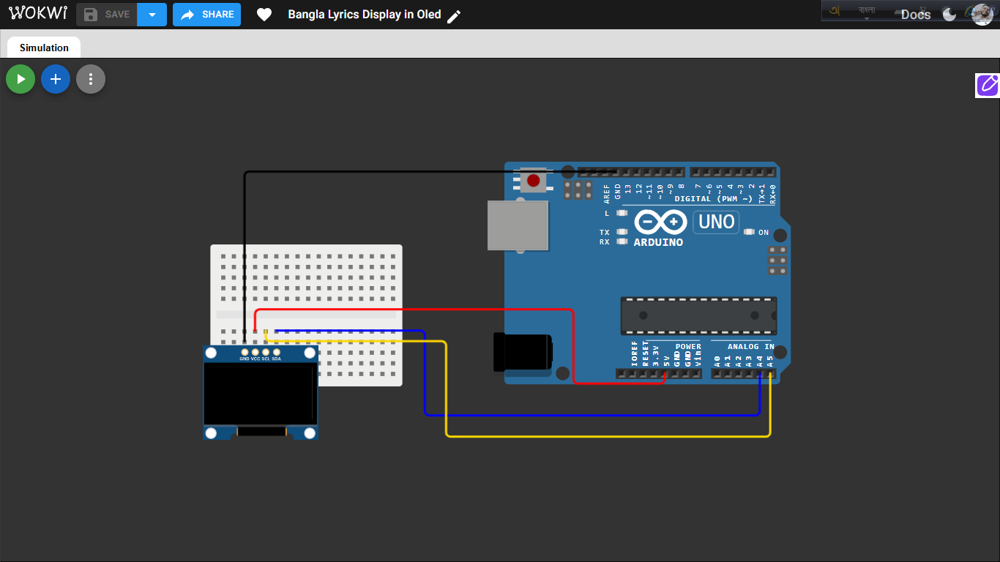

# OLED Lyric Sync

A small Arduino project that displays song bangla lyrics on a 128x64 I2C OLED screen, timed to sync with a song playing separately on a laptop/phone — like a mini offline karaoke display.

## What it does

- Shows a "Ready" screen on power-up
- Runs a 3-2-1 countdown so you can hit play on the song at the right moment
- Displays each lyric line at the correct time using an internal timer (no delay-blocking)
- Lyric lines are shown as full-screen bitmap images (handwritten/stylized Bangla text converted to 128x64 bitmaps), not typed font — this is how native Bangla script is shown, since no ready-made Bangla font exists for this OLED library
- Some lines are merged or split from the original lyrics to match how they're actually sung
- Shows a blinking animated outro ("See you in Day 8" + "SUBSCRIBE") after the last line

## Components used

- Arduino Uno
- 0.96" OLED display, SSD1306 driver, 128x64, I2C

## Wiring

| OLED Pin | Arduino Uno |
|---|---|
| GND | GND |
| VDD | 5V |
| SCL | A5 |
| SDA | A4 |

## Libraries required

Install via Arduino IDE Library Manager:
- **Adafruit SSD1306**
- **Adafruit GFX Library** (installs automatically as a dependency)

## Circuit

**Try it in simulation:** [https://wokwi.com/projects/475130164644313089] (might take a little time than usual to compile)

## How to use

1. Upload `ekhononekraatbangla.ino` to the Arduino.
2. Cue the song on a separate device to the exact timestamp the lyric array starts from.
3. Power on / reset the Arduino — it shows "Ready," then counts down 3...2...1.
4. Press play on the song the instant "1" disappears.
5. Lyrics display in sync as the song plays.
6. After the last line, the outro animation loops until the board is reset.

## How the Bangla lyric images were made

Each lyric line was typed in photopea, exported as a png, then converted to a 1-bit bitmap:
1. Crop tightly around the text
2. Resize to fit within 128x64, centered on a white canvas
3. Threshold to pure black/white
4. Pack into a byte array (`PROGMEM`) in the format `Adafruit_GFX`'s `drawBitmap()` expects

Each bitmap is ~1024 bytes of flash. With 13 lines embedded, this sketch is noticeably larger than a plain-text version — still fits in the Uno's 32KB flash, but leaves less headroom for future additions.

## Known limitations

- Sync relies on the person hitting play at the right moment — a manual reaction-time offset of ~100-300ms is normal.
- Native Bangla script is shown as bitmap images, not live/dynamic text — each line is a separate embedded image, so this only works for a short section of a song, not a full track, due to Arduino Uno's limited flash memory.
- Timestamps are hardcoded per song; each new song requires re-tracking and re-entering the lyric array.

## Possible future improvements

- Trigger song playback directly from the Arduino (e.g. via a DFPlayer Mini + SD card) to remove human reaction-time lag from the sync.
- Add sound-reactive or beat-synced animations between lyric lines.
- Move to a board with more flash memory to fit a full song's worth of bitmap lyric lines instead of just a short section.
